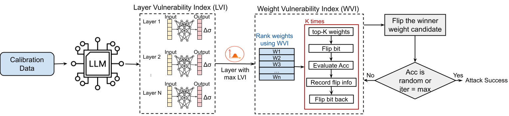

# Invisible Hands (ICCAD26)



Code Repository for the ICCAD 2026 Paper "Invisible Hands: Gray-Box Bit Flip Attack for Steering LLMs Without Knowledge of Gradients, Data, and Weights"

## Environment

Setup the environment:

```bash
cd Invisible-Hands
conda env create -f environment.yml
conda activate invisible-hands
cd Invisible-Hands/modules/eval
git clone https://github.com/wangziyannb/lm-evaluation-harness.git
cd lm-evaluation-harness
pip install -e .
```

## Usage
The following commands demonstrate how to run the different scripts for model evaluation, LVI, and WVI. Use the same commands with the corresponding configuration files for different models.
1. To evaluate the model before flipping:

   ```bash
   python main.py --config_path Test_scripts/Llama-2-7b.yml
   ```
2. To evaluate LVI: 
   ```bash
   python main.py --config_path LVI_scripts/Llama-2-7b.yml
   ```

3. To run Invisible-Hands on FP16 or INT8: 
   ```bash
   python main.py --config_path WVI_scripts/Llama-2-7b.yml
   ```

4. To run Invisible-Hands on INT4: 
   ```bash
   python main.py --config_path WVI_int4_scripts/Llama-2-7b.yml
   ```

   
